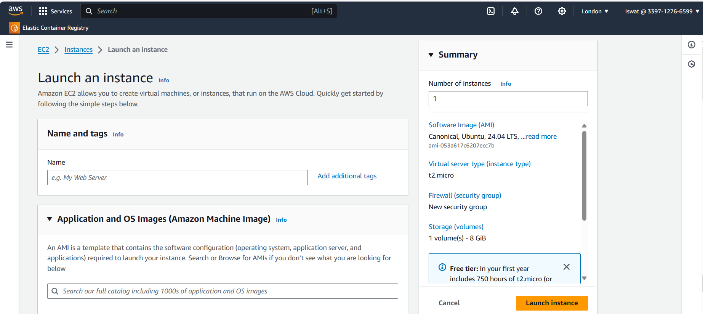
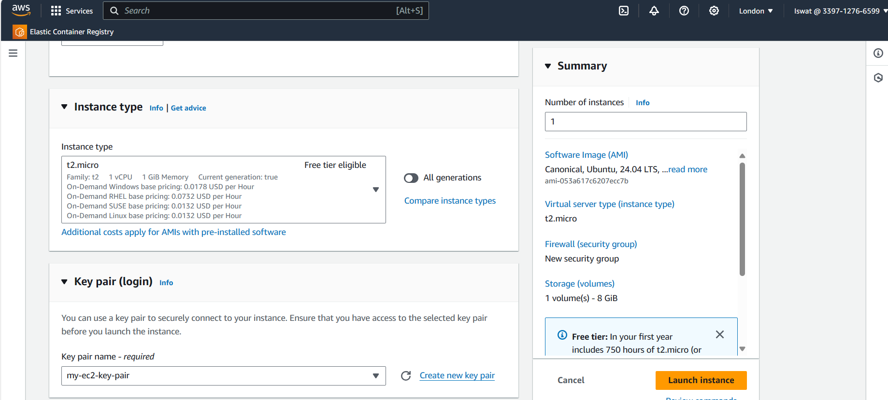
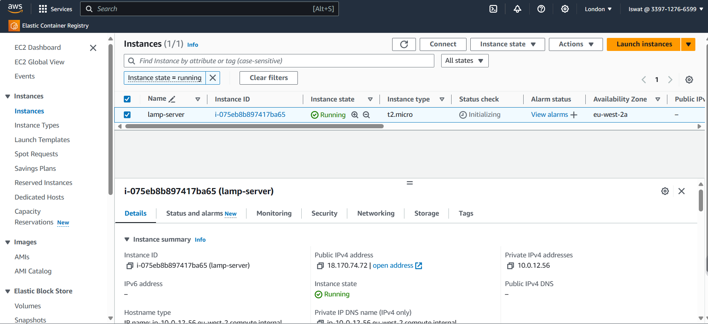
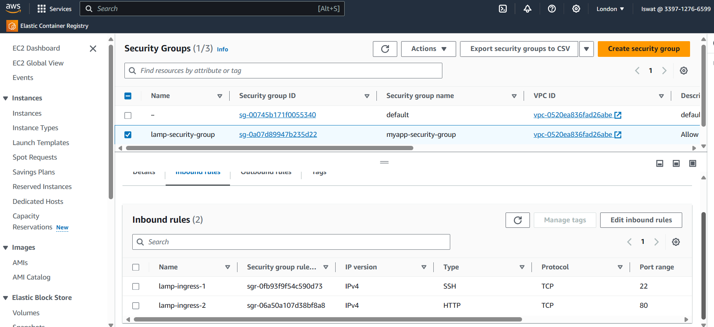
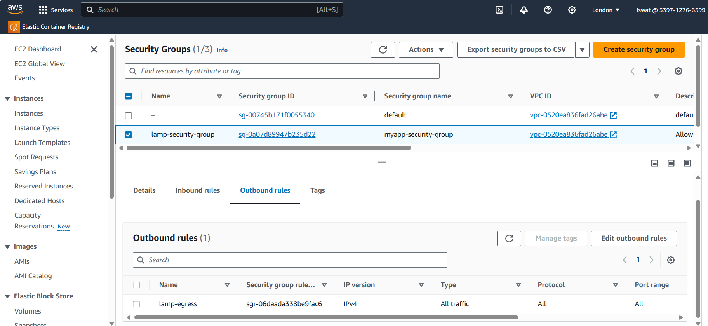

## WEB STACK IMPLEMENTATION (LAMP STACK) IN AWS

### Introduction:

__The LAMP stack is a popular open-source web development setup with four key parts: Linux, Apache, MySQL, and PHP (or occasionally Perl or Python). This documentation explains how to install, set up, and use the LAMP stack.__

## Step 0: Prerequisites

__1.__ EC2 Instance of t2.micro type and Ubuntu 22.04 LTS (HVM) was launched in the eu-west-2 region using terraform.





__2.__ Created SSH key pair named __my-ec2-key-pair__ to access the instance on port 22.

__3.__ The security group was configured with the following inbound and outbound rules:

- Allow inbound SSH traffic on port 22 from a specified IP range to the security group.
- Allow inbound HTTP traffic on port 80 from any source IP to the security group.
- Allow all outbound traffic from the security group to any destination IP.




__4.__ A new custom VPC with CIDR block (10.0.0.0/16) and subnet CIDR block (10.0.0.0/20) was used for the networking configuration.

__5.__ The private SSH key (PEM file) was downloaded. The file was moved to the .ssh directory, permissions were changed for the PEM file to allow only the _user owner_ read access, and then it was used to connect to the instance by running a command.

```
chmod 400 my-ec2-key-pair.pem
```
```
ssh -i "my-ec2-key-pair.pem" ubuntu@35.178.185.57
```
Where __username=ubuntu__ and __public ip address=35.178.185.57__


