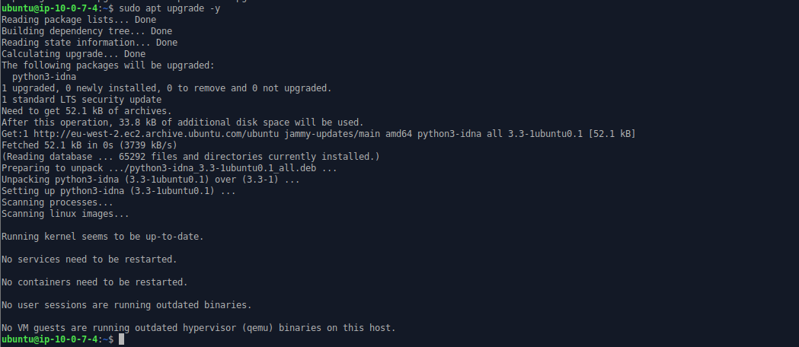

## WEB STACK IMPLEMENTATION (LEMP STACK) IN AWS

### Introduction
The LEMP stack is a widely-used, open-source platform for web development, comprising four key components: Linux, Nginx, MySQL, and PHP (or occasionally Perl or Python). 

This guide provides details on how to set up, configure, and use the LEMP stack. 

LEMP stands for Linux (operating system), Nginx (pronounced "engine-x" to account for the 'E'), MySQL (database), and PHP (scripting language).

### Step 0: Prerequisites
1. Create an AWS account with an IAM user that has permissions to create and manage EC2 instances, Security Groups, and Key Pairs. I ensured to assign least privilege permissions to the IAM user to follow security best practices.
2. Get basic familiarity with AWS services and the Linux command line interface.

3. Install Git Bash if you do not have it yet on your local machine.

4. Launch EC2 Instance of t2.micro type and Ubuntu 22.04 LTS (HVM) in the eu-west-2 region via the AWS management console.

5. Create SSH key pair named "my-ec2-key-pair" to access the instance on port 22 using the SSH command.

6. Configure the security group with the following inbound and outbound rules:

- Allow inbound SSH traffic on port 22 from a specified IP range to the security group.
- Allow inbound HTTP traffic on port 80 from any source IP to the security group.
- Allow all outbound traffic from the security group to any destination IP.

7. Create a new custom VPC with CIDR block (10.0.0.0/16) and subnet CIDR block (10.0.0.0/20) to be used for the networking configuration.


8. Navigate to the EC2 dashboard on the AWS management console to view the launched EC2 instance and summary of its properties.


9. Download the private SSH key (PEM file). Move the file to the **.ssh** directory. Change permissions for the PEM file to allow only the user owner read access, and then connect to the instance by running the command below.

```
chmod 400 my-ec2-key-pair.pem
```
```
ssh -i "my-ec2-key-pair.pem" ubuntu@3.9.114.144
```
Where **username=ubuntu** and **public ip address=3.9.114.144**


## Step 1 - Install nginx web server
1. **Update and Upgrade the local apt package index**

```
sudo apt update
sudo apt upgrade -y
```



2. **Install Nginx using Ubuntu's package manager "apt"**
```
sudo apt install nginx -y
```


3. **Enable the nginx service**

```
sudo systemctl enable nginx
```


4. **Confirm that Nginx is active and running**
```
sudo systemctl status nginx
```


> The image above shows that Nginx is directly running on your EC2 instance.

5. **Access nginx locally from the ubuntu shell**
```
curl http://localhost:80
curl http://127.0.0.1:80
```
**This command performs the following:**
> When you use curl http://127.0.0.1:80 on an EC2 instance where Nginx is running, you're accessing Nginx's web server locally. 
>
>The address 127.0.0.1 is a loopback address that points to the local machine itself. 
>
>Port 80 is the default HTTP port, where Nginx listens for incoming HTTP requests. 
>
>Therefore, by using 127.0.0.1:80, you're accessing Nginx's web server on the same EC2 instance where you're executing the curl command. 
>
>This works because Nginx is configured to listen for incoming requests on port 80, and when accessing it via 127.0.0.1, you're essentially making a request to the web server running on the same machine.


6. Test how the Nginx server respond to requests from internet via a web browser.


