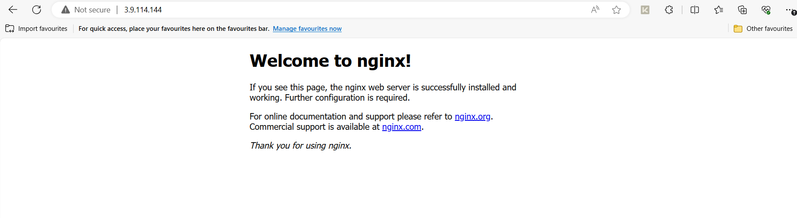
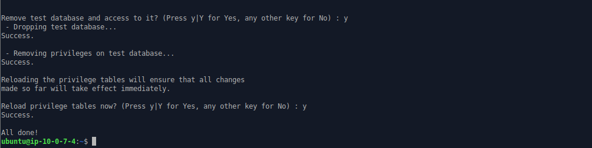
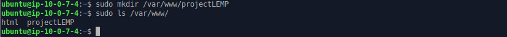

# WEB STACK IMPLEMENTATION (LEMP STACK) IN AWS

## Introduction
The LEMP stack is a widely-used, open-source platform for web development, comprising four key components: Linux, Nginx, MySQL, and PHP (or occasionally Perl or Python). 

This guide provides details on how to set up, configure, and use the LEMP stack. 

LEMP stands for Linux (operating system), Nginx (pronounced "engine-x" to account for the 'E'), MySQL (database), and PHP (scripting language).

## Step 0: Prerequisites
1. Create an AWS account with an IAM user that has permissions to create and manage EC2 instances, Security Groups, and Key Pairs. I ensured to assign least privilege permissions to the IAM user to follow security best practices.
2. Get basic familiarity with AWS services and the Linux command line interface.

3. Install Git Bash if you do not have it yet on your local machine.

4. Launch EC2 Instance of t2.micro type and Ubuntu 22.04 LTS (HVM) in the eu-west-2 region via the AWS management console.

5. Create SSH key pair named "my-ec2-key-pair" to access the instance on port 22 using the SSH command.

6. **Configure the security group with the following inbound and outbound rules:**

- Allow inbound SSH traffic on port 22 from a specified IP range to the security group.
- Allow inbound HTTP traffic on port 80 from any source IP to the security group.
- Allow all outbound traffic from the security group to any destination IP.

7. **Create a new custom VPC with CIDR block (10.0.0.0/16) and subnet CIDR block (10.0.0.0/20) to be used for the networking configuration.**


8. **Navigate to the EC2 dashboard on the AWS management console to view the launched EC2 instance and summary of its properties.**


9. **Download the private SSH key (PEM file). Move the file to the **.ssh** directory. Change permissions for the PEM file to allow only the user owner read access, and then connect to the instance by running the command below.**

```
chmod 400 my-ec2-key-pair.pem
```
```
ssh -i "my-ec2-key-pair.pem" ubuntu@3.9.114.144
```
Where **username=ubuntu** and **public ip address=```
http://18.209.18.61:80**


## Step 1 - Install nginx web server
1. **Update and Upgrade the local apt package index**

```
sudo apt update
sudo apt upgrade -y
```


2. **Install Nginx using Ubuntu's package manager "apt"**
```
sudo apt install nginx -y
```


3. **Enable the nginx service**

```
sudo systemctl enable nginx
```


4. **Confirm that Nginx is active and running**
```
sudo systemctl status nginx
```


> The image above shows that Nginx is directly running on your EC2 instance.

5. **Access nginx locally from the ubuntu shell**
```
curl http://localhost:80
curl http://127.0.0.1:80
```
**This command performs the following:**
> When you use curl http://127.0.0.1:80 on an EC2 instance where Nginx is running, you're accessing Nginx's web server locally. 
>
>The address 127.0.0.1 is a loopback address that points to the local machine itself. 
>
>Port 80 is the default HTTP port, where Nginx listens for incoming HTTP requests. 
>
>Therefore, by using 127.0.0.1:80, you're accessing Nginx's web server on the same EC2 instance where you're executing the curl command. 
>
>This works because Nginx is configured to listen for incoming requests on port 80, and when accessing it via 127.0.0.1, you're essentially making a request to the web server running on the same machine.


6. **Test how the Nginx server respond to requests from internet via a web browser.**
```
http://3.9.114.144:80
```


This shows that the web server is correctly installed and it is accessible throuhg the firewall.

7. **Another way to retrieve the public ip address instead of checking the aws console.
```
curl -s http://169.254.169.254/latest/meta-data/public-ipv4
```


### Step 2 - Install MySQL
1. **Install MySQL using Ubuntu's package manager "apt"**
```
sudo apt install mysql-server
```


2. **Enable the mysql service and confirm it is running.**
```
sudo systemctl enable mysql
sudo systemctl status mysql
```


3. **Log in to mysql console.**
```
sudo mysql
```
This will connect to MySQL server as the administrative database root user, which is inferred by the use of sudo when running this command.


4. **Set a password for root user using mysql_native_password as default authentication method.**

Here, the root user's password was defined as "Admin123$"

```
ALTER USER 'root'@'localhost' IDENTIFIED WITH mysql_native_password BY 'Admin123$';
```


**Exit the MySQL shell**
```
exit
```

Summary of step 3 - 4


5. **Start the interactive script by running the command below.**
Running this script is a recommended step after installing MySQL to ensure your database is secure from common vulnerabilities.
```
sudo mysql_secure_installation -y
```



6. **Re-login into MySQL console to test the new credentails.**
The -p flag in the command will prompt you to enter the new password that you have set for the root user.
```
sudo mysql -p
```
Exit
```
exit
```


## Step 3 - Install PHP
1. **Install php**
Install php-fpm (PHP fastCGI process manager). Also, install php-mysql, a php module that allows PHP to communicate with MySQL-based databases. Core PHP packages will automatically be installed as dependencies.

The following were installed:
- php-fpm (PHP fastCGI process manager)
- php-mysql

```
sudo apt install php-fpm php-mysql -y
```


2. **Check PHP version.**
```
php -v
```


## Step 4 - Configure nginx to use PHP processor
1. **Create a root web directory for your_domain.**
```
sudo mkdir /var/www/projectLEMP
```


2. **Assign ownership of the directory created in step 1 to the environment variable $USER, which will reference the current system user.**
```
sudo chown -R $USER:$USER /var/www/projectLEMP
```


3. **Create and open a new configuration file in Nginx’s “sites-available” directory.
```
sudo vim /etc/nginx/sites-available/projectLEMP
```
Paste in the following bare-bones configuration:

```
server {
  listen 80;
  server_name projectLEMP www.projectLEMP;
  root /var/www/projectLEMP;

  index index.html index.htm index.php;

  location / {
    try_files $uri $uri/ =404;
  }

  location ~ \.php$ {
    include snippets/fastcgi-php.conf;
    fastcgi_pass unix:/var/run/php/php8.1-fpm.sock;
  }

  location ~ /\.ht {
    deny all;
  }
}
```
Save configuration and exit vim editor.


### Here’s what each directives and location blocks does:

- **listen** - Defines what port nginx listens on. In this case it will listen on port 80, the default port for HTTP.

- **root** - Defines the document root where the files served by this website are stored.

- **index** - Defines in which order Nginx will prioritize the index files for this website. It is a common practice to list index.html files with a higher precedence than index.php files to allow for quickly setting up a maintenance landing page for PHP applications. You can adjust these settings to better suit your application needs.

- **server_name** - Defines which domain name and/or IP addresses the server block should respond for. Point this directive to your domain name or public IP address.

- **location /** - The first location block includes the try_files directive, which checks for the existence of files or directories matching a URI request. If Nginx cannot find the appropriate result, it will return a 404 error.

- **location ~ \.php$** - This location handles the actual PHP processing by pointing Nginx to the fastcgi-php.conf configuration file and the php7.4-fpm.sock file, which declares what socket is associated with php-fpm.

- **location ~ /\.ht** - The last location block deals with .htaccess files, which Nginx does not process. By adding the deny all directive, if any .htaccess files happen to find their way into the document root, they will not be served to visitors.

4. **Activate the configuration in step 3 by linking to the config file from Nginx's sites-enabled directory.**
```
sudo ln -s /etc/nginx/sites-available/projectLEMP /etc/nginx/sites-enabled/
```


This will tell Nginx to use this configuration when next it is reloaded.

5. **Test the configuration for syntax error.**
```
sudo nginx -t
```


6. **Disable the default Nginx host that is currently configured to listen on port 80.**
```
sudo unlink /etc/nginx/sites-enabled/default
```


